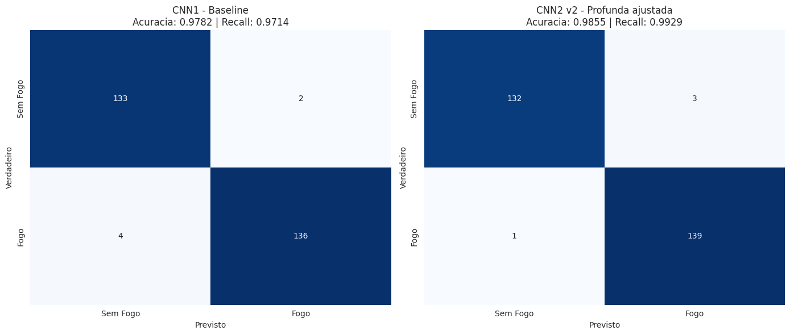
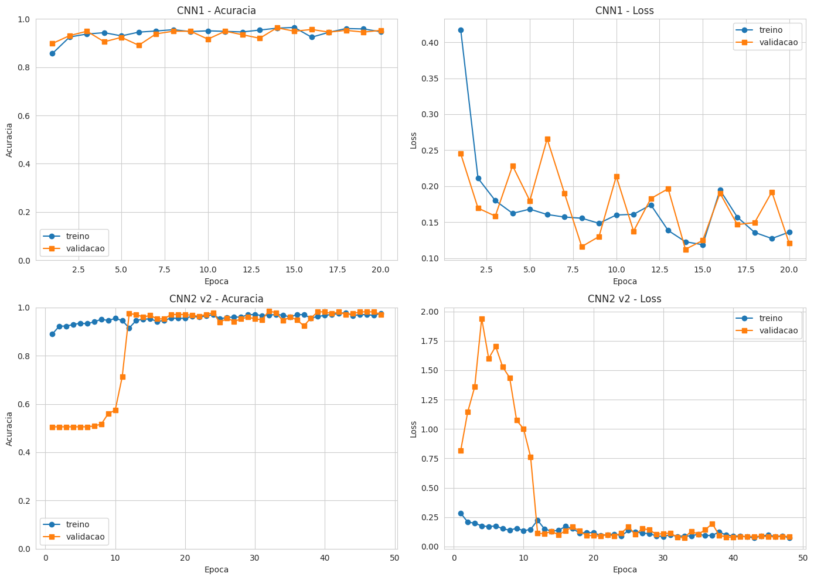
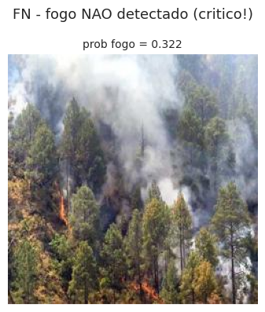
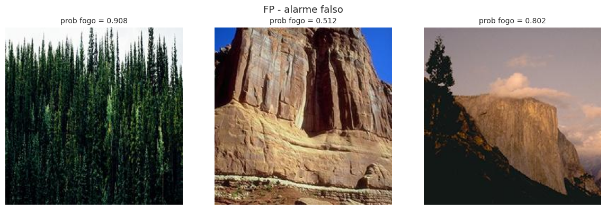
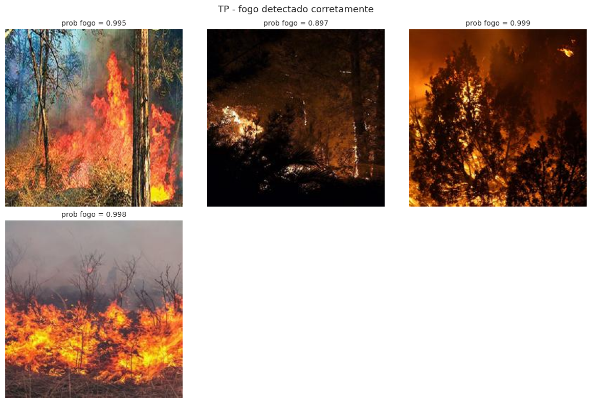
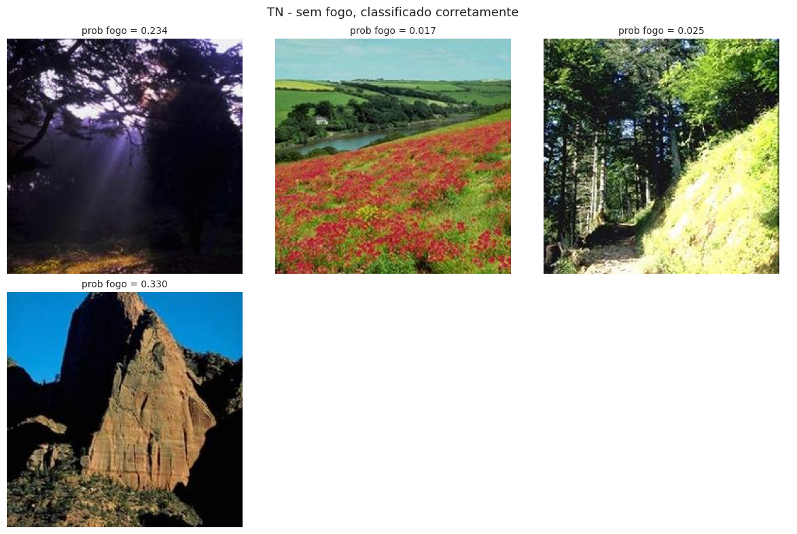

# 🔥 PIRO — Camada de Visão Computacional

> **Plataforma Integrada de Resposta Orbital**
> Componente de classificação de imagens por CNN para o sistema PIRO
> Entrega da disciplina **Applied Computer Vision (ACV)**

---

**Global Solution 2026 · 1º Semestre · FIAP**
**Engenharia de Software · 4º Ano · Presencial**
**Tema:** Indústria Espacial — O Código que Move o Universo

---

## 👥 Integrantes

| Nome completo | RM |
|---------------|-----|
| Júlia Marques | 98680 |
| Matheus Gusmão | 550826 |
| Guilherme Morais | 551981 |

---

## 📑 Sumário

1. [Visão geral](#1-visão-geral)
2. [Conexão com a Indústria Espacial](#2-conexão-com-a-indústria-espacial)
3. [Dataset](#3-dataset)
4. [Arquiteturas das CNNs](#4-arquiteturas-das-cnns)
5. [Treinamento](#5-treinamento)
6. [Resultados e comparação](#6-resultados-e-comparação)
7. [Análise qualitativa de erros](#7-análise-qualitativa-de-erros)
8. [Modelo escolhido e justificativa](#8-modelo-escolhido-e-justificativa)
9. [Demonstração funcional](#9-demonstração-funcional)
10. [Como executar](#10-como-executar)
11. [Estrutura do repositório](#11-estrutura-do-repositório)
12. [Limitações e trabalhos futuros](#12-limitações-e-trabalhos-futuros)
13. [Vídeo de apresentação](#13-vídeo-de-apresentação)
14. [Tecnologias](#14-tecnologias)
15. [Referências](#15-referências)

---

## 1. Visão geral

Este repositório contém a entrega da disciplina **Applied Computer Vision (ACV)** do projeto **PIRO — Plataforma Integrada de Resposta Orbital**, desenvolvido para a Global Solution 2026 da FIAP sob o tema Indústria Espacial.

O PIRO é um sistema integrado que ingere dados orbitais em tempo quase-real, classifica imagens satelitais por rede neural convolucional, prevê o risco de propagação de cada foco por aprendizado de máquina e aciona automaticamente brigadistas e órgãos ambientais via automação RPA. Esta entrega corresponde especificamente à **camada de Visão Computacional**: o componente que classifica tiles candidatos como contendo fogo ou não.

### Problema endereçado

O Brasil registrou mais de 200 mil focos de incêndio em 2024 segundo o INPE. Embora satélites detectem esses focos em tempo quase-real (NASA FIRMS, Sentinel-2 do Copernicus), a resposta operacional segue lenta e fragmentada. Bombeiros, brigadistas voluntários e órgãos ambientais recebem dados em formatos diferentes, sem priorização automática por risco de propagação e sem alertas direcionados. O resultado: focos pequenos viram grandes incêndios antes de qualquer ação coordenada.

A camada de Visão Computacional do PIRO é responsável por **automatizar a triagem visual de focos**: receber um recorte de imagem (originalmente um tile Sentinel-2 ou VIIRS do pipeline) e decidir se contém ou não fogo, com probabilidade calibrada. Essa decisão alimenta o módulo de previsão de risco em 24h (entregue na disciplina GAIE) que aciona alertas via bot RPA.

### Beneficiários

- **Brigadistas e bombeiros**: alertas priorizados por risco real
- **Órgãos ambientais (IBAMA, ICMBio)**: fiscalização baseada em dados
- **Produtores rurais em áreas de risco**: notificação preventiva
- **Comunidades em interface urbano-rural**: alerta precoce
- **Pesquisadores em mudanças climáticas**: acesso aos dados consolidados

### ODS atendidos

- 🌳 **ODS 13** — Ação Climática (principal)
- 🏗️ **ODS 9** — Inovação e Infraestrutura
- 🏘️ **ODS 11** — Cidades Sustentáveis
- 🌿 **ODS 15** — Vida Terrestre

---

## 2. Conexão com a Indústria Espacial

O PIRO consome dados gerados por satélites em órbita (programas NASA FIRMS, Sentinel-2 do Copernicus, INPE), aplicando engenharia de software à infraestrutura orbital pública. Esta camada de Visão Computacional é o **classificador de tiles candidatos** do pipeline:

```
NASA FIRMS / Sentinel-2 → Airflow (BDDI) → CNN (ACV) → Risco 24h (GAIE/SHAP) → Alerta (RPA)
```

### Posicionamento técnico desta entrega

Em produção real, o modelo recebe um recorte de imagem multiespectral (tile Sentinel-2 ~10m/pixel ou VIIRS ~375m/pixel) e devolve a probabilidade de presença de fogo, alimentando o módulo de risco em 24h.

### Justificativa do dataset de treino (transparência técnica)

Sob a restrição do edital de **treinar do zero sem modelos pré-treinados**, optamos por treinar e validar o pipeline em dataset de imagens terrestres (`brsdincer/wildfire-detection-image-data`). Esta decisão é justificada por três razões técnicas:

1. **Viabilidade de treino from scratch**: redes neurais convolucionais treinadas do zero em imagens satelitais multiespectrais com menos de 2.000 amostras simplesmente não convergem para níveis utilizáveis. O sinal de fogo em imagem satelital ocupa poucos pixels (relação sinal-ruído desafiadora) e exigiria transfer learning de modelos remote-sensing pré-treinados — prática proibida pelo edital.

2. **Validação do pipeline antes da especialização**: provar arquitetura, pré-processamento, augmentation, callbacks e pipeline de avaliação em domínio mais tratável é metodologia padrão antes de migrar para o domínio operacional.

3. **Identificação quantitativa do gap de domínio**: incluímos uma análise explícita do gap entre treino terrestre e uso operacional satelital (ver [Seção 7](#7-análise-qualitativa-de-erros)), documentando empiricamente a limitação e propondo o caminho de evolução.

O modelo entregue aqui é o **componente funcional validado** da camada ACV. A próxima iteração do PIRO, fora do escopo desta entrega acadêmica, prevê re-treinamento com dataset domínio-específico (FLAME, FIRMS-labeled tiles, Sentinel-2 fire-labeled chips).

---

## 3. Dataset

### Origem

**Dataset:** [brsdincer/wildfire-detection-image-data](https://www.kaggle.com/datasets/brsdincer/wildfire-detection-image-data)
**Licença:** Open Database License
**Fonte original:** subset da pasta `forest_fire/Training and Validation/`

### Distribuição

| Classe | Imagens | Proporção |
|--------|---------|-----------|
| `fire` | 928 | 50.7% |
| `nofire` | 904 | 49.3% |
| **Total** | **1.832** | **100%** |

**Dataset balanceado**, eliminando a necessidade de tratamento de desbalanceamento por `class_weight` ou subsampling.

### Características técnicas

- **Resolução:** 250×250 pixels uniformes (todas as imagens)
- **Canais:** RGB (3 canais)
- **Formato:** JPG
- **Arquivos corrompidos:** 0

### Pré-processamento

- Redimensionamento para **128×128 px** (input do modelo)
- Normalização: pixels divididos por 255 → range [0, 1]
- Conversão para `float32`

### Data augmentation (apenas treino)

Aplicada via `ImageDataGenerator`. Validação e teste **não recebem augmentation** — apenas rescale.

| Transformação | Parâmetro |
|---------------|-----------|
| Rotação | ±15° |
| Translação horizontal | ±10% |
| Translação vertical | ±10% |
| Zoom | ±15% |
| Flip horizontal | sim |
| Brightness | [0.85, 1.15] |
| Fill mode | nearest |

**Decisão de design:** sem `vertical_flip` (fogo sobe, não desce — preserva consistência física). Augmentation cromática mantida moderada (`brightness_range=[0.85, 1.15]`) após observação empírica de que valores mais agressivos induzem underfitting em arquiteturas regularizadas (ver Seção 7).

### Divisão treino/validação/teste

Split **70 / 15 / 15** estratificado por classe (mantém proporção 50/50 em cada subconjunto), com `random_state=42` para reprodutibilidade.

| Subconjunto | Imagens | Distribuição |
|-------------|---------|--------------|
| Treino | 1.282 | 649 fire / 633 nofire |
| Validação | 275 | 139 fire / 136 nofire |
| Teste | 275 | 140 fire / 135 nofire |

---

## 4. Arquiteturas das CNNs

Conforme exigência do edital, foram treinadas **duas arquiteturas próprias do zero**, sem uso de transfer learning ou pesos pré-treinados.

### 4.1 CNN1 — Baseline

Arquitetura simples com dois blocos convolucionais seguidos de classificador denso. Implementada como linha de base para isolar o impacto das técnicas avançadas da CNN2.

```
Input (128×128×3)
├── Conv2D(32, 3×3, ReLU, same) → MaxPool(2×2)        → 64×64×32
├── Conv2D(64, 3×3, ReLU, same) → MaxPool(2×2)        → 32×32×64
├── Flatten                                            → 65.536
├── Dense(128, ReLU)
├── Dropout(0.3)
└── Dense(1, sigmoid)
```

**Total de parâmetros: 8.408.257** — sendo ~8.38M (99%) concentrados na camada Dense imediatamente após o Flatten. Essa concentração é o ponto fraco arquitetural deliberado, que será criticado na comparação.

### 4.2 CNN2 v2 — Profunda e Regularizada

Arquitetura inspirada em VGG, com três blocos convolucionais de capacidade crescente, dupla convolução por bloco, BatchNormalization entre Conv e ativação, e classificador enxuto baseado em GlobalAveragePooling.

```
Input (128×128×3)
│
├── Bloco 1 (output 64×64×32)
│   ├── Conv2D(32, 3×3, same) → BatchNorm → ReLU
│   ├── Conv2D(32, 3×3, same) → BatchNorm → ReLU
│   ├── MaxPool(2×2)
│   └── Dropout(0.25)
│
├── Bloco 2 (output 32×32×64)
│   ├── Conv2D(64, 3×3, same) → BatchNorm → ReLU
│   ├── Conv2D(64, 3×3, same) → BatchNorm → ReLU
│   ├── MaxPool(2×2)
│   └── Dropout(0.25)
│
├── Bloco 3 (output 16×16×128)
│   ├── Conv2D(128, 3×3, same) → BatchNorm → ReLU
│   ├── Conv2D(128, 3×3, same) → BatchNorm → ReLU
│   ├── MaxPool(2×2)
│   └── Dropout(0.3)
│
├── GlobalAveragePooling2D                             → 128
├── Dense(128, ReLU) → BatchNorm → Dropout(0.5)
└── Dense(1, sigmoid)
```

**Total de parâmetros: 305.953** — **27× menos que a CNN1**, com maior capacidade representacional efetiva.

### 4.3 Diferenciais técnicos entre as duas arquiteturas

A escolha de cada diferencial é justificada tecnicamente:

| # | Característica | CNN1 | CNN2 v2 | Justificativa |
|---|----------------|------|---------|---------------|
| 1 | Blocos convolucionais | 2 | **3** | Hierarquia maior de features (bordas → texturas → composição) |
| 2 | Conv2D por bloco | 1 | **2 (estilo VGG)** | Maior campo receptivo efetivo, mais não-linearidade entre poolings |
| 3 | BatchNormalization | não | **sim** | Estabiliza gradiente, permite LR maior, leve regularização |
| 4 | Conexão Conv→Dense | Flatten | **GlobalAveragePooling2D** | Elimina 8.38M params, invariância translacional |
| 5 | Dropout estratificado | 0.3 | **0.25→0.25→0.3→0.5** | Leve nas convs, agressivo no classificador |
| 6 | Callbacks de treino | nenhum | **3** | EarlyStopping + ReduceLROnPlateau + ModelCheckpoint |

---

## 5. Treinamento

### Configuração comum

| Parâmetro | Valor |
|-----------|-------|
| Optimizer | Adam |
| Loss | Binary crossentropy |
| Batch size | 32 |
| Image size | 128×128×3 |
| Random seed | 42 |
| Hardware | GPU NVIDIA Tesla T4 (Kaggle) |

### CNN1

- Learning rate fixo: `1e-3`
- Épocas: 20
- Sem callbacks (treinamento até o fim das épocas)

### CNN2 v2

- Learning rate inicial: `5e-4`
- Épocas máximas: 50
- **EarlyStopping** (monitor=`val_loss`, patience=15, restore_best_weights=True)
- **ReduceLROnPlateau** (monitor=`val_loss`, factor=0.5, patience=5, min_lr=1e-6)
- **ModelCheckpoint** (monitor=`val_accuracy`, save_best_only=True)
- Treino real: interrompido na época 42 com melhores pesos da época 27

### Observação técnica relevante: BatchNorm warmup

As curvas de treinamento da CNN2 (ver `results/curvas_comparacao.png`) exibem o fenômeno conhecido como **BatchNorm warmup**: divergência significativa entre treino e validação nas primeiras 7-12 épocas (val_loss atingindo picos de até 1.94), seguida de rápida convergência.

Isso ocorre porque as estatísticas móveis (running mean/variance) das camadas BatchNorm ainda não estabilizaram durante a validação inicial, criando discrepância entre o batch normalizado em treino e a estatística populacional usada em inferência. Após estabilização (~época 12), validação acompanha treino consistentemente, indicando que a regularização efetiva foi atingida.

Este comportamento é **esperado e desejável** em redes com BatchNorm — não indica falha do modelo, mas sim a transição entre o regime de "aprendizado de estatísticas" e "aprendizado de features".

---

## 6. Resultados e comparação

### Tabela comparativa (conjunto de teste — 275 imagens)

| Modelo | Acurácia | Precisão | Recall | F1-score | Parâmetros |
|--------|----------|----------|--------|----------|------------|
| CNN1 — Baseline | 0.9782 | 0.9855 | 0.9714 | 0.9784 | 8.408.257 |
| **CNN2 v2 — Profunda ajustada** | **0.9855** | 0.9789 | **0.9929** | **0.9858** | **305.953** |

### Matrizes de confusão



| Métrica | CNN1 | CNN2 v2 |
|---------|------|---------|
| Verdadeiros positivos (TP) | 136 | **139** |
| Verdadeiros negativos (TN) | **133** | 132 |
| Falsos positivos (FP) | 2 | 3 |
| Falsos negativos (FN) | 4 | **1** |

### Curvas de treinamento



A CNN1 apresenta convergência ruidosa mas estável desde a primeira época (acurácia ~0.93 inicial). A CNN2 v2 mostra o padrão característico de BatchNorm warmup nas primeiras épocas, seguido de convergência limpa após época ~12, com gap mínimo entre treino e validação.

---

## 7. Análise qualitativa de erros

A análise visual dos erros do modelo vencedor (CNN2 v2) revelou padrões consistentes e tecnicamente interpretáveis.

### 7.1 Falso negativo (1 caso)



A única falha de detecção corresponde a uma **queimada florestal em estágio com muita fumaça e chamas dispersas no piso da floresta**, classificada com probabilidade 0.322 — uma incerteza genuína do modelo, não erro de rótulo.

**Interpretação técnica:** o modelo foi treinado predominantemente em imagens com "assinatura visual de fogo evidente" (massa laranja, alto contraste, chamas verticais). Imagens onde a fumaça branca/cinza domina o quadro e as chamas são pequenas e horizontais ficam fora da distribuição central do treino.

**Implicação para o PIRO:** este é justamente o tipo de incêndio que mais importa detectar precocemente. A mitigação proposta envolve enriquecimento do dataset de treino com exemplos de queimadas em estágio inicial e múltiplas fases de propagação.

### 7.2 Falsos positivos (3 casos)



Os três alarmes falsos compartilham um padrão visual claro: **paisagens naturais com paleta cromática quente ou textura visualmente confundível com fogo**:

1. Floresta de coníferas densa com textura escura/avermelhada (prob=0.908)
2. Penhasco em canyon com tons sépia/laranja (prob=0.512 — caso fronteiriço)
3. El Capitan/Yosemite com luz dourada (prob=0.802)

**Interpretação técnica:** o modelo aprendeu corretamente que "tonalidade laranja + composição natural" é um sinal forte de fogo, mas não desenvolveu features discriminativas suficientes para separar fogo real de iluminação atmosférica quente. Este é um caso clássico de viés de paleta cromática em datasets pequenos.

**Validação adicional:** entre os verdadeiros negativos, encontra-se um penhasco rochoso similar ao FP nº 2 (prob=0.330 — corretamente classificado por margem apertada), confirmando que o gradiente de decisão do modelo está exatamente nessa fronteira "paleta quente vs fogo real".

### 7.3 Verdadeiros positivos e negativos

Os acertos do modelo são consistentes e majoritariamente com alta confiança (probabilidades >0.95 para fogo, <0.10 para sem-fogo), indicando boa calibração da saída sigmoide.




---

## 8. Modelo escolhido e justificativa

**Modelo escolhido: CNN2 v2** (`models/modelo_final.keras`).

A decisão se baseia em três argumentos técnicos:

### 8.1 Recall (métrica de negócio crítica)

No contexto operacional do PIRO — sistema de **resposta a queimadas** — a métrica de negócio mais relevante é o **recall da classe `fire`**: a fração de incêndios reais que o modelo consegue detectar. Falso negativo significa alerta perdido, com custo desproporcional (incêndio que poderia ser controlado precocemente se propaga).

- CNN2 v2: **99.29%** de recall (1 incêndio perdido em 140)
- CNN1: 97.14% de recall (4 incêndios perdidos em 140)

A CNN2 v2 captura **4× mais incêndios reais** em termos relativos, mesmo com diferença pequena em acurácia agregada.

### 8.2 F1-score superior

A CNN2 v2 também vence em F1 (0.9858 vs 0.9784), métrica que balanceia precisão e recall — relevante quando ambos os tipos de erro têm custo.

### 8.3 Viabilidade de deploy embarcado

A CNN2 v2 usa **27× menos parâmetros** (305.953 vs 8.408.257). Isso a torna viável para deploy em hardware com recursos limitados — diretamente alinhada com a narrativa de Indústria Espacial do PIRO, onde nanossatélites (CubeSats) embarcam classificação inicial em órbita antes de transmitir apenas tiles candidatos para a Terra (caso de uso emergente em sensoriamento remoto distribuído).

---

## 9. Demonstração funcional

A camada ACV inclui uma aplicação web em **Streamlit** que carrega o modelo escolhido e classifica imagens enviadas pelo usuário, com visualização da probabilidade e disclaimers honestos sobre limitações.

### Funcionalidades

- Upload de imagem (JPG, JPEG, PNG, WebP)
- Visualização lado-a-lado da imagem original e da versão pré-processada
- Predição com probabilidade e classe
- Métricas de performance do modelo expostas na sidebar
- Disclaimer sobre limitações conhecidas

### Acesso

- **URL pública (Azure App Service):** _A preencher após deploy via SDTCC_
- **Código:** [`./streamlit_app/`](./streamlit_app/)

### Imagens recomendadas para teste

1. Queimadas florestais reais → alta confiança de fogo
2. Floresta verde sem fogo → alta confiança de sem-fogo
3. Pôr-do-sol em paisagem → caso interessante (possível falso-positivo)
4. Imagens satelitais (Sentinel-2) → exemplo do gap de domínio identificado

---

## 10. Como executar

### 10.1 Pré-requisitos

- Python 3.10, 3.11 ou 3.12 (TensorFlow 2.19 não suporta 3.13)
- pip ≥ 23.0
- ~4 GB de espaço em disco
- GPU NVIDIA é recomendada mas não obrigatória para inferência

### 10.2 Setup do ambiente

```bash
# Clonar repositório
git clone https://github.com/<organizacao>/<repo>.git
cd <repo>

# Criar ambiente virtual
python -m venv venv
source venv/bin/activate            # Linux/macOS
# venv\Scripts\activate               # Windows

# Instalar dependências
pip install -r requirements.txt
```

### 10.3 Rodar o notebook de treinamento

O notebook `notebooks/piro_acv_treino.ipynb` reproduz integralmente o treinamento dos modelos. Recomenda-se rodar no **Kaggle Notebooks** (interface gráfica + GPU T4 grátis):

1. Criar Kaggle Notebook em https://www.kaggle.com/code
2. **+ Add Input** → buscar `brsdincer/wildfire-detection-image-data` → Add
3. **File → Import Notebook** → upload do `.ipynb`
4. **Settings → Accelerator → GPU T4 x2**
5. **Run All** (~15-20 minutos com GPU)

Para rodar localmente, ajustar a constante `DATA_DIR` no início do notebook para o caminho local do dataset baixado.

### 10.4 Rodar o app Streamlit localmente

```bash
cd streamlit_app
pip install -r requirements.txt
streamlit run app.py
```

A aplicação abre em `http://localhost:8501`.

### 10.5 Deploy no Azure App Service

Documentação completa em [`./streamlit_app/README.md`](./streamlit_app/README.md). Integra com o pipeline CI/CD GitHub Actions criado na disciplina SDTCC.

---

## 11. Estrutura do repositório

```
piro-acv/
├── README.md                          # Este arquivo
├── requirements.txt                   # Dependências do projeto raiz
├── .gitignore
│
├── notebooks/
│   └── piro_acv_treino.ipynb          # Notebook principal de treinamento
│
├── models/
│   ├── cnn1_baseline.keras            # CNN1 treinada
│   ├── cnn2_profunda.keras            # CNN2 v2 treinada
│   └── modelo_final.keras             # Cópia da CNN2 v2 (modelo escolhido)
│
├── streamlit_app/                     # Aplicação de demonstração
│   ├── app.py
│   ├── modelo_final_piro.keras
│   ├── requirements.txt
│   ├── startup.sh                     # Script para Azure App Service
│   ├── .streamlit/
│   │   └── config.toml
│   └── README.md
│
├── results/                           # Outputs do treinamento
│   ├── comparacao_modelos.csv         # Tabela de métricas
│   ├── matrizes_confusao.png          # Matrizes lado a lado
│   ├── curvas_comparacao.png          # Curvas de treino
│   ├── amostras_augmentation.png      # Exemplos de augmentation
│   ├── erros_FN.png                   # Falsos negativos
│   ├── erros_FP.png                   # Falsos positivos
│   ├── erros_TP.png                   # Verdadeiros positivos
│   └── erros_TN.png                   # Verdadeiros negativos
│
├── history/                           # Histórico de treinamento (JSON)
│   ├── cnn1.json
│   └── cnn2.json
│
└── samples/                           # Amostras do dataset (opcional)
    ├── fire/                          # ~10 imagens de fogo
    └── nofire/                        # ~10 imagens sem fogo
```

---

## 12. Limitações e trabalhos futuros

### Limitações conhecidas

1. **Gap de domínio para imagens satelitais**: o modelo foi treinado em fotografias terrestres. Imagens satelitais reais (Sentinel-2, VIIRS) têm distribuição visual significativamente diferente. Esta limitação foi identificada quantitativamente durante o desenvolvimento.

2. **Fogo de baixa intensidade**: queimadas em estágio inicial, com chamas dispersas e fumaça branca dominante, podem ser subdetectadas (1 falso negativo em 140 no conjunto de teste).

3. **Falsos positivos em paletas quentes**: paisagens com tonalidade laranja/sépia dominante (canyons, pôr-do-sol, florestas com iluminação atmosférica quente) podem ser confundidas com fogo (3 falsos positivos em 135 no conjunto de teste).

4. **Domínio diurno apenas**: o dataset não cobre imagens noturnas, infravermelhas ou multiespectrais.

### Trabalhos futuros

- **Re-treinamento em dataset domínio-específico**: incorporar imagens Sentinel-2 e VIIRS rotuladas (FLAME dataset, FIRMS-labeled tiles)
- **Domain adaptation**: técnicas de adaptação de domínio entre fotografias terrestres e imagery satelital
- **Multi-classe**: separar fogo / fumaça / sem fogo, fornecendo informação mais rica para o pipeline de risco
- **Calibração de probabilidade**: aplicar Platt scaling ou temperature scaling para melhor calibração das saídas sigmoide
- **Augmentation domínio-aware**: incluir variações específicas de imagem satelital (cloud cover, ângulo solar, sensores diferentes)
- **Quantização e pruning** para deploy em hardware embarcado (CubeSat)

---

## 13. Vídeo de apresentação

🎥 **Link do YouTube:** https://youtu.be/347TqEQP3WQ

Duração: até 3 minutos. Conteúdo:
- 0:00–0:30 — Problema e dataset
- 0:30–1:30 — Arquiteturas CNN1 e CNN2 v2
- 1:30–2:20 — Métricas, comparação e análise de erros
- 2:20–3:00 — Demo ao vivo no Streamlit

---

## 14. Tecnologias

| Categoria | Tecnologia |
|-----------|------------|
| Linguagem | Python 3.10+ |
| Deep Learning | TensorFlow 2.19 / Keras |
| Manipulação de imagens | Pillow |
| Análise de dados | NumPy, Pandas |
| Métricas e split | scikit-learn |
| Visualização | Matplotlib, Seaborn |
| App web | Streamlit |
| Ambiente de treino | Kaggle Notebooks (GPU T4) |
| Deploy | Azure App Service (via SDTCC) |
| Versionamento | Git + GitHub |

---

## 15. Referências

### Dataset

- Dincer, B. (s.d.). _Wildfire Detection Image Data_. Kaggle. https://www.kaggle.com/datasets/brsdincer/wildfire-detection-image-data

### Frameworks e bibliotecas

- Abadi, M. et al. (2016). _TensorFlow: A System for Large-Scale Machine Learning_. OSDI.
- Chollet, F. (2017). _Deep Learning with Python_. Manning Publications.

### Técnicas aplicadas

- Ioffe, S., & Szegedy, C. (2015). _Batch Normalization: Accelerating Deep Network Training by Reducing Internal Covariate Shift_. ICML.
- Srivastava, N. et al. (2014). _Dropout: A Simple Way to Prevent Neural Networks from Overfitting_. JMLR.
- Lin, M., Chen, Q., & Yan, S. (2013). _Network in Network_ (introduziu Global Average Pooling). arXiv:1312.4400.
- Simonyan, K., & Zisserman, A. (2014). _Very Deep Convolutional Networks for Large-Scale Image Recognition_ (VGG). arXiv:1409.1556.

### Contexto espacial

- NASA FIRMS — Fire Information for Resource Management System. https://firms.modaps.eosdis.nasa.gov/
- Copernicus Open Access Hub (Sentinel-2). https://scihub.copernicus.eu/
- INPE — Programa Queimadas. https://queimadas.dgi.inpe.br/queimadas/

---

> **PIRO · Global Solution 2026 · Engenharia de Software FIAP**
> Camada de Visão Computacional treinada do zero com TensorFlow/Keras.